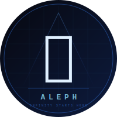

  
  
  # Técnicas y Herramientas Modernas
  ### ⚙️ Grupo Aleph

---

## 🗂️ Índice del Proyecto
Acá podés encontrar acceso rápido a todos los documentos que fuimos armando para este módulo:

* 📝 **[Tarea 1 - Integrantes del Grupo](tarea1.md)**: Tabla oficial con los datos del equipo.
* 🤝 **[Acuerdos del Grupo](Acuerdos.md)**: Reglas de trabajo y comunicación que definimos.
* 🔗 **[Enlaces Útiles](Enlaces.md)**: Recursos y links importantes para la materia.

---

## 👥 Perfiles de GitHub de los integrantes:
- **Luciano Correa Pol**: [Link al repositorio](https://github.com/luciano-correapol/T-cnicas-y-herramientas-modernas)
- **Enzo Scala**: [Link al repositorio](https://github.com/enzoscala431-cloud/modulo-1)
- **Juan Marcos Aguirre**: [Link al repositorio](https://github.com/AguirreJuanMarcos/Modulo_1)
- **Tomás Vera**: [Link al repositorio](https://github.com/veratomas/modulo-1)
- **Tomás Cabrera**: [Link al repositorio](https://github.com/tomascabrera1453-spec/M-dulo-1)
